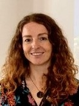
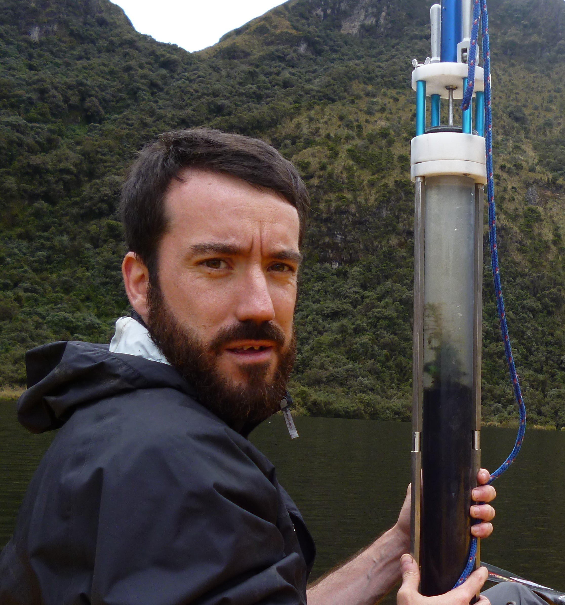
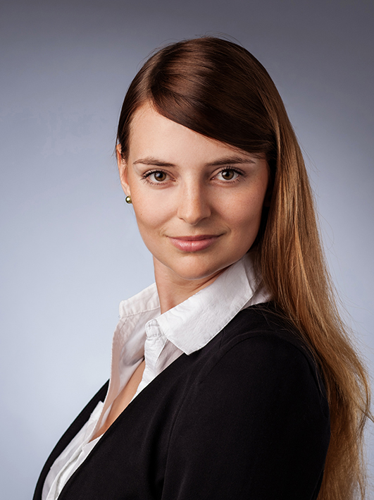

# COST Action Steering Committee

```{r}
#| label: setup
#| include: false
options(htmltools.dir.version = FALSE)
knitr::opts_chunk$set(
  fig.align = "center",
  out.width = "100%",
  dpi = 300,
  fig.align = "center"
)

if (!require("here")) install.packages("here")
library(here)

here::i_am("coregroup.qmd")

# Load colors from JSON
if (!require("jsonlite")) install.packages("jsonlite")
library(jsonlite)

colors <-
  jsonlite::fromJSON(
    here::here("colors.json")
  )

writeLines(
  text = c(
    "// This file is auto-generated from colors.json. Do not edit directly.",
    paste0("$", names(colors), ": ", unname(colors), ";")
  ),
  con = here::here("_colors.scss")
)
```

## Chairs

### Dr Thomas Giesecke 

-   
-   🏦Utrecht University, NL
-   📞phone: +31302531034
-   📬email: t.giesecke(at)uu.nl
-   [, '.svg')`)](https://orcid.org/0000-0002-5132-1061)
-   [, '.svg')`)](https://www.uu.nl/staff/TGiesecke)

### Dr Sandra Nogué Bosch 

-   
-   🏦UAB Barcelona, ES
-   📞phone: 935814669
-   📬email: sandra.nogue(at)uab.cat
-   [, '.svg')`)](https://orcid.org/0000-0003-0093-4252)
-   [, '.svg')`)](https://portalrecerca.uab.cat/en/persons/sandra-nogue-bosch)

## Leadership & Staff (Alphabetical order)

### Dr Xavier Benito 
-   [](/About/working_groups.qmd#wg2-aquatic-proxies)
-   🏦Institute of Agrifood Research and Technology (IRTA), Spain
-   📬email: xavier.benito(at)irta.cat
-   [, '.svg')`)](https://orcid.org/0000-0003-0792-2625)
-   [, '.svg')`)](https://xbenitogranell.github.io)

### Prof Richard Bradshaw 

-   
-   🏦 University of Liverpool, UK
-   📬email: Richard.Bradshaw(at)liv.ac.uk
-   [, '.svg')`)](https://orcid.org/0000-0002-7331-2246)
-   [, '.svg')`)](https://www.liverpool.ac.uk/environmental-sciences/staff/richard-bradshaw/)

### Dr Sandra Olivia Camara-Brugger 

-   
-   🏦 University of Basel, Environmental Sciences
-   📬email: Sandra.bruegger(at)unibas.ch
-   [, '.svg')`)](https://orcid.org/0000-0003-4188-2276)
-   [, '.svg')`)](https://universe.unibas.ch/people/21725/47862/overview)


### Dr Kirsten Elger

-   [](/About/working_groups.qmd#wg3-infrastructure-and-databases)

### Dr Stefan Engels  

-   [](/About/working_groups.qmd#wg2-aquatic-proxies)
-   🏦 Royal Holloway University of London, UK
-   📬email: Stefan.Engels(at)rhul.ac.uk
-   [](https://orcid.org/0000-0002-2078-0361)
-   [](https://pure.royalholloway.ac.uk/en/persons/stefan-engels/)

<br>

### Dr Walter Finsinger 
-   
-   🏦 Institut des Sciences de l'Evolution de Montpellier (ISEM), CNRS, France
-   📬email: walter.finsinger(at)umontpellier.fr
-   [, '.svg')`)](https://orcid.org/0000-0002-8297-0574)
-   [, '.svg')`)](https://isem-evolution.fr/membre/finsinger/)

### Ms Aldona Gembalik

-   

### Dr Graciela Gil-Romera 

-   [](/About/working_groups.qmd#wg4-outreach-and-education)
-   \
-   🏦 Pyrenean Institute of Ecology (Spanish Research Council), Zaragoza, Spain
-   📬email: graciela.gil(at)ipe.csic.es
-   [, '.svg')`)](https://orcid.org/0000-0001-5726-2536)
-   [, '.svg')`)](https://www.gilromera.com)

### Dr Petr Kuneš 

-   [](/About/working_groups.qmd#wg1-terrestrial-proxies)
-   🏦 Charles University, CZ
-   📞phone: +420 221 961 667
-   📬email: petr.kunes(at)natur.cuni.cz
-   [, '.svg')`)](https://orcid.org/0000-0001-9605-8204)
-   [, '.svg')`)](https://natur.cuni.cz/en/person?poid=1494806729387701)

### Dr Ondřej Mottl 

-   [](/About/working_groups.qmd#wg3-infrastructure-and-databases)
-   🏦Department of Botany, Faculty of Science, Charles University, Prague, Czech Republic
-   📬email: ondrej.mottl(at)gmail.com
-   [, '.svg')`)](https://orcid.org/0000-0002-9796-5081)
-   [, '.svg')`)](https://ondrejmottl.github.io/)

### Dr Federica Ortelli

-   

### Dr Anneli Poska 

-  [](/About/working_groups.qmd#wg1-terrestrial-proxies)
-  🏦TalTech, Estonia
-  📬email: anneli.poska(at)taltech.ee
-  [, '.svg')`)](https://orcid.org/0000-0002-8778-1430)

### Dr Celia Martin Puertas

-   [](/About/working_groups.qmd#wg4-outreach-and-education)


## Non active Members of the Core Group

### Prof Elisabeth Dietze 

-   🏦 University of Göttingen, Germany
-   📬email: edietze(at)uni-goettingen.de
-   [, '.svg')`)](https://orcid.org/0000-0003-4817-8441)
-   [, '.svg')`)](https://www.uni-goettingen.de/de/662289.html)
